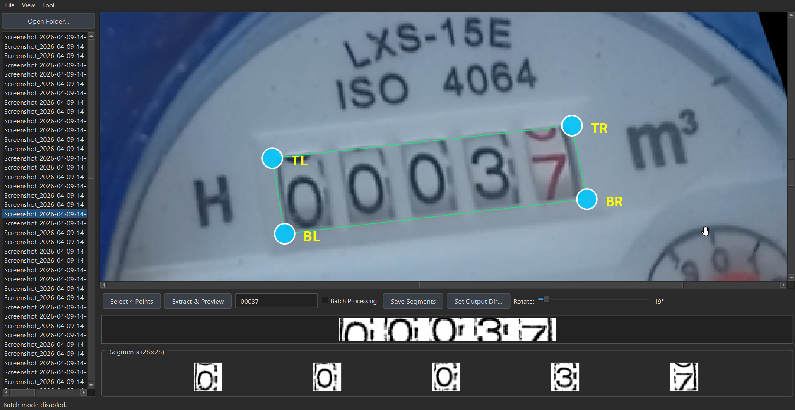
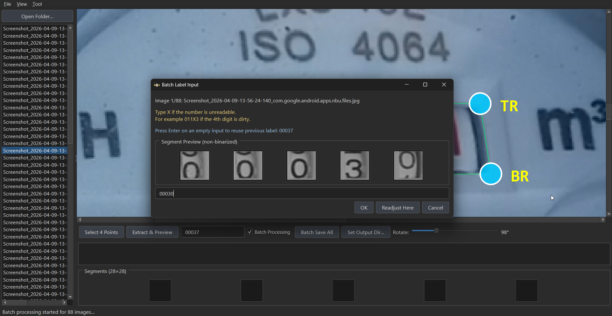
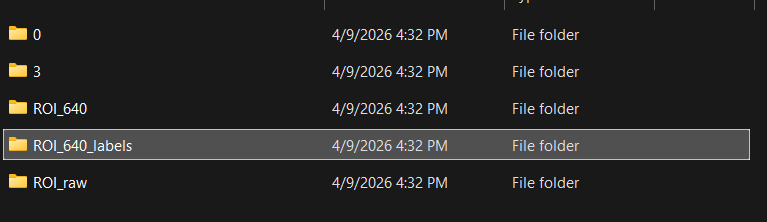
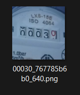

# DigitExtractor

DigitExtractor is a PyQt6 + OpenCV desktop tool for building two datasets from the same annotation pass:

- LeNet-5 friendly digit crops (5 x 28x28 per sample)
- YOLO friendly ROI images + label files

It is designed for fast real-world data prep from perspective-distorted photos.



## Why This Is LeNet-5 Friendly

- Fixed output shape per digit: 28x28 grayscale.
- One sample always becomes 5 segments (140x28 strip split into 5 cells).
- Clean folder-based class structure for training loaders.
- Supports unreadable characters using X mapped to Unreadable.

## Why This Is YOLO Friendly

- Each saved sample also exports ROI datasets:
  - ROI_raw (tight ROI crop)
  - ROI_640 (square scene-context crop resized to 640x640)
  - ROI_640_labels (YOLO txt labels)
- Label line format is standard YOLO normalized xywh:

```txt
<class_id> <x_center> <y_center> <width> <height>
```

- Current class id is 0 by default.

## Current Features

- Open image folders and browse images quickly in a sidebar.
- Supports png, jpg, jpeg, bmp, tiff, tif, webp, heic, heif.
- HEIC/HEIF fallback support via Pillow + pillow-heif.
- 0 to 359 degree rotation slider.
- 4-point selection with:
  - drag handles for fine tuning
  - drag inside polygon to move all 4 points together
- Extract and preview binarized strip + 28x28 segments.
- Label validation: exactly 5 chars using only 0 to 9 and X.
- Single-image save and batch save workflows.
- Batch modal label entry with non-binarized preview.
- Enter on empty batch input reuses previous label.
- Readjust Here pauses batch, removes processed files from list, and resumes from selected image with inherited rotation + zoom + points.
- Tool menu includes Invert Colors for dataset post-processing.

## Output Structure

After saving, output directory contains per-digit folders plus ROI exports.

```text
<output_dir>/
  0/
  1/
  ...
  9/
  Unreadable/
  ROI_raw/
  ROI_640/
  ROI_640_labels/
```

### Segment Files (LeNet-5 side)

- Path: `<output_dir>/<digit_or_Unreadable>/segment_<8hex>.png`
- One save operation writes 5 segment files.

### ROI Files (YOLO side)

- Base name: `<LABEL>_<UID>`
- Raw ROI: `ROI_raw/<LABEL>_<UID>_raw.png`
- 640 ROI: `ROI_640/<LABEL>_<UID>_640.png`
- YOLO label: `ROI_640_labels/<LABEL>_<UID>_640.txt`

Example:

- `011X9_a1b2c3d4e5_raw.png`
- `011X9_a1b2c3d4e5_640.png`
- `011X9_a1b2c3d4e5_640.txt`

### ROI 640 Generation Note

- A square context crop is built from the real scene around the ROI bounding box.
- Context margin ratio is 0.20.
- If crop exceeds image bounds, reflect padding is used only to complete the square.
- The square crop is then resized to 640x640.

## Quick Start

### Windows

1. Install Python 3.10+ and ensure it is in PATH.
2. Run one of:
  - `Run_Windows.bat`
  - `Run_Windows2.bat` (uses `python -m pip` for requirements install)
3. First run creates `.venv`, installs requirements, and launches the app.

### macOS / Linux

1. Ensure Python 3 is installed.
2. If needed: `chmod +x Run_Mac.command`
3. Run `Run_Mac.command`.

## Manual Run (Developer)

```bash
python -m venv .venv
source .venv/bin/activate  # Windows: .venv\Scripts\activate
python -m pip install -r requirements.txt
python main.py
```

## Single Image Workflow

1. Click Open Folder and choose your image directory.
2. Select an image from the list.
3. Adjust Rotate if needed.
4. Click Select 4 Points and click corners in order (auto-sorted to TL/TR/BR/BL).
5. Click Extract and Preview.
6. Enter label with exactly 5 chars using 0-9 and X.
7. Click Set Output Dir if not set.
8. Click Save Segments.

## Batch Workflow (One Setup Reused)

1. Load folder and pick a representative image.
2. Set rotation and 4 points once.
3. Enable Batch Processing.
4. Click Batch Save All.
5. For each image, modal appears with non-binarized segment preview:
  - type 5-char label (0-9 and X)
  - Enter on empty input reuses previous label
  - use Readjust Here to pause and re-align on that image
6. Continue until complete or cancel.

## Invert Colors Tool

From Tool -> Invert Colors:

1. Select parent input folder containing category subfolders.
2. Allowed subfolder names:
  - single digits 0-9
  - optional Unreadable
3. Select output folder.
4. App writes inverted copies preserving category folder names.

## Controls And Shortcuts

- Ctrl+O: Open folder
- F: Fit image to view
- Esc: Cancel / clear current 4-point selection
- Mouse wheel: Zoom
- Drag on canvas (normal mode): Pan
- Drag point handles: Fine-tune corners
- Drag inside polygon: Move all 4 points together

## Dependencies

- PyQt6
- opencv-python
- numpy
- Pillow
- pillow-heif

See requirements.txt for version pins.

## Screenshots

Main UI:


Batch processing modal flow:



Extracted strip examples:

.png)

.png)

ROI and label structure examples:





## Add More Demo Images

You can add more screenshots under assets/screenshot and reference them in this README.
