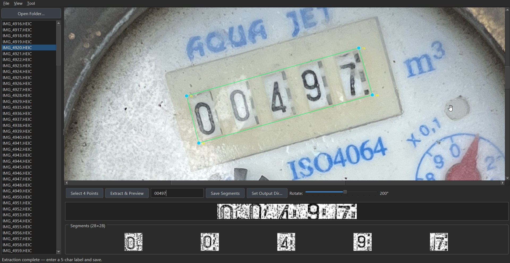

# DigitExtractor

**High-Precision Image Dataset Extractor** for creating robust 28x28 digit/character datasets from perspective-distorted real-world images. Perfect for building custom MNIST-style training datasets for Machine Learning models.

## 🎯 Features

- **Universal Auto-Installer:** Ships with zero-touch setup wrappers for Windows (`Run_Windows.bat`) and Mac/Linux (`Run_Mac.command`) that manage a hidden, isolated python environment automatically. No Antivirus (.exe) threat detections.
- **HEIC Image Support Ecosystem:** Fully native support for iOS `.HEIC` and `.HEIF` image arrays, bypassing standard limitations via deep Pillow integrations.
- **Continuous 360° Rotation:** High-performance rotation slider using `cv2.getRotationMatrix2D` ensuring the image is strictly squared mathematically up-front.
- **4-Point Perspective Warp:** Intelligently corrects lens warps and off-angle photos into a flat strip via adaptive projection mapping.
- **Automated Segmentation Filtering:** Automatically splits the defined region into exactly five 28x28 segmented files using adaptive thresholding and 3x3 median blur for ML-ready outputs.
- **Directory Output Mapping:** Auto-categorizes saved segments. Give it a 5-character string (e.g. `00497`), and it sorts the segments into `.../0/`, `.../4/`, `.../9/`, etc.

## 🚀 Quick Start (No Python Knowledge Required)

You do **not** need to manually install dependencies or touch the command line.

### Windows
1. Unzip the downloaded folder anywhere.
2. Double-click **`Run_Windows.bat`**.
3. It will automatically check for Python, set up a local private environment, install the ML dependencies quietly, and launch the app.
*(Future launches will open instantly).*

### macOS / Linux
1. Unzip the downloaded folder.
2. Open terminal and run `chmod +x Run_Mac.command` if it needs permissions.
3. Double-click **`Run_Mac.command`** from Finder.
4. It seamlessly builds your local application environment and launches the UI.

## 📖 Usage Workflow

1. **Load Directory:** Click **Open Folder...** to select your raw image batch (supports folders with hundreds of `.HEIC`, `.JPG`, or `.PNG` images).
2. **Setup View:** Use the **Rotate** slider at the bottom if your image was taken upside-down or sideways. Mouse-wheel to zoom.
3. **Locate Target:** Click **Select 4 Points**, then click the 4 corners of the digit sequence in your photo.
4. **Extract:** Click **Extract & Preview** to see the isolated binary result.
5. **Categorize:** Enter the text sequence seen in the image inside the label box (exactly 5 characters, e.g., `A8B3Z`). Set your base output directory.
6. **Save:** Click **Save Segments**. The app automatically routes the cut-out digits to `/<output_dir>/<character>/segment_<uuid>.png`.

### Output Results Example

ML-ready threshold extraction saves cleanly categorized images to disk.

**Result - Uninverted:**

.png)

**Result - Inverted:**
*(Depends on raw material contrast)*

.png)

## 🛠️ Technical Details & Libraries

The application circumvents heavy ML pipelines in favor of pure, extremely fast computer-vision math.
- **PyQt6 (GUI):** Advanced graphic scenes, caching, splitters, and native window rendering.
- **OpenCV & NumPy:** Array operations, real-time matrix math for rotation, interpolation resizing, Gaussian blurring, and color-to-binary mapping.
- **Pillow / pillow-heif:** Hard fallback mechanisms capable of handling modern iPhone imagery natively.

## ⌨️ Keyboard Shortcuts

| Shortcut | Description |
|-----|--------|
| `F` | Fit image to view perfectly |
| `Esc` | Cancel 4-point selection mode |
| `Ctrl+O` | Open a new folder |
| `Mouse Wheel` | Pan & Zoom Canvas |
